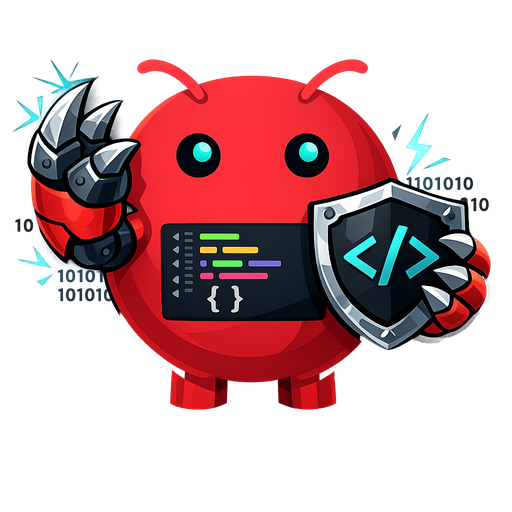

<p align="center">
  
</p>

<h1 align="center">DeskClaw Code Editor</h1>

<p align="center">
  <strong>An AI-Native Code Editor & IDE Powered by Autonomous OpenClaw Agent</strong><br />
  Featuring VS Code Copilot-Style Agent Chat, Inline AI Edit (<code>Ctrl+K</code>), AI Commit Message Generator, Split Terminal, Skill Marketplace, GitHub Tools Integration, and Project Health Audit.<br />
  <strong>Windows · macOS · Linux</strong>
</p>

<p align="center">
  <a href="https://github.com/99apps-id/deskclaw-code-editor/releases/latest">
    
  </a>
  <a href="https://github.com/99apps-id/deskclaw-code-editor/actions/workflows/ci.yml">
    
  </a>
  <a href="LICENSE">
    
  </a>
</p>

---

## 📸 Screenshots & Product Gallery

### 1. VS Code-Style OpenClaw AI Chat & Monaco Code Editor


### 2. VS Code Copilot Agent Chat Panel (Interactive Code Blocks & Context Attachment)


### 3. ClawHub Skill & Extension Marketplace


---

## ✨ Flagship Features

### 🎨 1. VS Code-Style OpenClaw AI Agent Chat
- **Interactive Code Blocks**: 1-click **Copy Code** and **Insert at Cursor** directly into Monaco Editor.
- **Context Attachment**: 1-click **`+ Active file`** and **`+ Selection`** context pills.
- **Export & Clear History**: Export entire AI transcripts to Markdown (`.md`) or clear chat history in 1-click.

### 🪄 2. Inline AI Code Edit (`Ctrl+K`)
- Floating prompt widget anchored directly above Monaco selection when pressing `Ctrl+K`.
- Stream generated replacement code and apply directly to the active selection.

### 📝 3. AI Commit Message Generator (`GitPanel.tsx`)
- 1-click **"✨ AI Msg"** button that reads Git working tree changes and generates conventional commit messages.

### 🖥️ 4. Side-by-Side Split Terminal (`TerminalPanel.tsx`)
- 2-column split terminal toggle button (`Columns` icon) to view dual terminal sessions side by side.

### 🧩 5. ClawHub Skill & Extension Marketplace (`SkillMarketplaceModal.tsx`)
- Search, inspect, and 1-click install autonomous AI Skills and Extensions from ClawHub (`Ctrl+Shift+P` -> *ClawHub Skill Marketplace*).

### 🧠 6. Workspace Memory & Rules Editor (`MemoryEditorModal.tsx`)
- View and edit `.openclaw/workspace-notes.md`, `AGENTS.md`, and project guidelines (`Ctrl+Shift+P` -> *Edit Project Memory & Rules*).

### ✨ 7. AI Error Fixer on Problems Panel (`ProblemsPanel.tsx`)
- 1-click **"✨ Fix with AI"** button next to each diagnostic error/warning to let OpenClaw AI fix the code line.

### 🐙 8. GitHub Tools & Pull Request Panel (`GitHubPanel.tsx`)
- Pull Request viewer and 1-click **Create PR** workflow integrated with GitHub CLI (`gh`).

### 🌿 9. Dynamic Git Branch Switcher (`GitPanel.tsx`)
- Interactive branch picker button to switch or create branches (`git checkout -b`).

### 💡 10. Monaco AI Context Menu Actions
- Right-click menu items in Monaco: **✨ OpenClaw: Explain Code** and **✨ OpenClaw: Refactor Selection**.

### 🎨 11. Theme & Accent Color Studio (`SettingsPanel.tsx`)
- Theme accent color swatches: **Blue**, **Emerald**, **Purple**, **Amber**, and **Crimson**.

### ⚡ 12. Project Health & Dependency Audit (`ProjectHealthPanel.tsx`)
- Audit `package.json`, dependency count, health status, and main scripts.

### 🚀 13. Quick Project Starter & Scaffolder (`ProjectStarterModal.tsx`)
- 1-click scaffolding for React + Vite, Next.js, Electron App, Express REST API, and Android Native (Kotlin).

### 📸 14. Code Snippet Image Exporter (`SnippetExporterModal.tsx`)
- Export selected Monaco code into modern gradient card images (Carbon / Ray.so style).

### 📊 15. Real-time AI Activity Status Bar
- Real-time status indicator showing active OpenClaw agent state, cursor position, and character count.

---

## 🛠️ Installation & Quick Start

### Prerequisites
- **Node.js**: `v20.x` or `v22.x`
- **pnpm**: `v9.x` or `v10.x`

### Dev Setup
```bash
# Clone repository
git clone https://github.com/99apps-id/deskclaw-code-editor.git
cd deskclaw-code-editor

# Install dependencies
pnpm install

# Run dev mode
pnpm dev
```

### Production Build & Packaging
```bash
# Type check & build
pnpm run type-check
pnpm run build

# Package for Windows (.exe installer)
pnpm run package:win
```

---

## 📄 License

Distributed under the MIT License. See `LICENSE` for more information.
